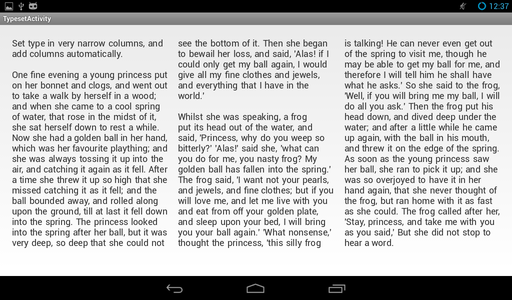
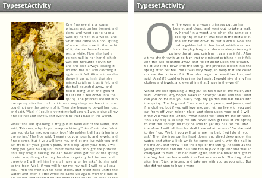
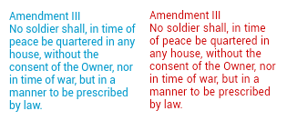
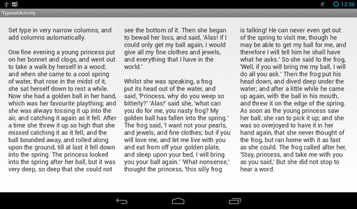

# TypesetView

TypesetView gives you an [android View](https://developer.android.com/reference/android/view/View.html) that's great for displaying paragraphs of rag-right static body text. It adds typographic niceties from more sophisticated text layout engines, allowing refined control over your content.

#### Multicolumn text


You can either directly set the number of columns, or just specify a minimum column width. If you set a minimum column width, TypesetView will automatically add columns based on the available width.

#### Flexible margins



You can programatically control the margins for each line in the View. You can even write code to flow text around arbitrary paths, like around the large "O" glyph above.

#### Advanced linebreaks
Unlike TextView, TypesetView wraps lines after examining a full paragraph of text. This allows it to minimize long gaps in a paragraph of rag-right text, if possible. Here is a side-by-side comparison of TextView on the left, and TypesetView on the right.



TypesetView has moved the word "of" from the first line down to the second line, which leaves a slightly bigger gap for the first line. However, this lets it avoid a much larger gap in the third line. Software typophiles - it minimizes the sum of the squares of the end-of-line gaps in text that's set rag-right. It uses a variation of the Knuth-Plass algorithm (used in TeX.) It doesn't hyphenate words, and the "badness" of a line is simply the square of the right-side gap. The last line is ignored in the calculations.

#### And lastly...

A couple of small typographic controls.



First, you can allow the expansion of inter-word spaces in controlled amounts, if you want to further minimize gaps at the ends of lines.

Second, you can set the [typographic leading](https://en.wikipedia.org/wiki/Leading) explicitly, rather than TextView's unintuitive spacing "multipliers" and "adders". If you want to set text at 16/18dp - you just set typeSize and typeLeading to 16dp and 18dp respectively.

## Using TypesetView

Just add `typesetview-library` as a library project. To add a TypesetView within your layout, you might do something like

```XML
    <ScrollView
      xmlns:android="http://schemas.android.com/apk/res/android"
      xmlns:typeset="http://schemas.android.com/apk/res-auto"
      android:layout_width="match_parent"
      android:layout_height="wrap_content">

      <org.kbsriram.android.typesetview.TypesetView
          android:layout_width="match_parent" 
          android:layout_height="wrap_content"
          typeset:typeColor="#ff303030"
          typeset:typeSize="12sp"/>
    </ScrollView>
```

Notice that you should use `http://schemas.android.com/apk/res-auto` to refer to the attributes that are specific to TypesetView.

Here are the TypesetView specific attributes you can specify.

`typeText` is a String, the text to display.
`typeColor` is a Color to use for the text.
`typeSize` is a dimension for the text size.
`typeLeading` is a dimension for the leading (ie. the distance between baselines of text.
`typeGutterWidth` is a dimension for the space between columns of text.
`typeMaximumLineStretch` is a dimension that controls the maximum amount a line is permitted to expand. By default, it is equal to the leading.
`typeMaximumGlueExpansionRatio` is a float and must be larger than `1`. Spaces between words are not allowed to expand larger than this ratio. By default, it is `1.22`
`typeColumnWidth` is a dimension. Specify this to set a minimum column size, and TypesetView will automatically add columns as needed. If you specify this, you cannot also specify `typeColumnCount`.
`typeColumnCount` is an integer greater than `0`. Specify this to set exactly this many columns, regardless of the width of the view. If you specify this, you cannot also specify `typeColumnWidth`.
